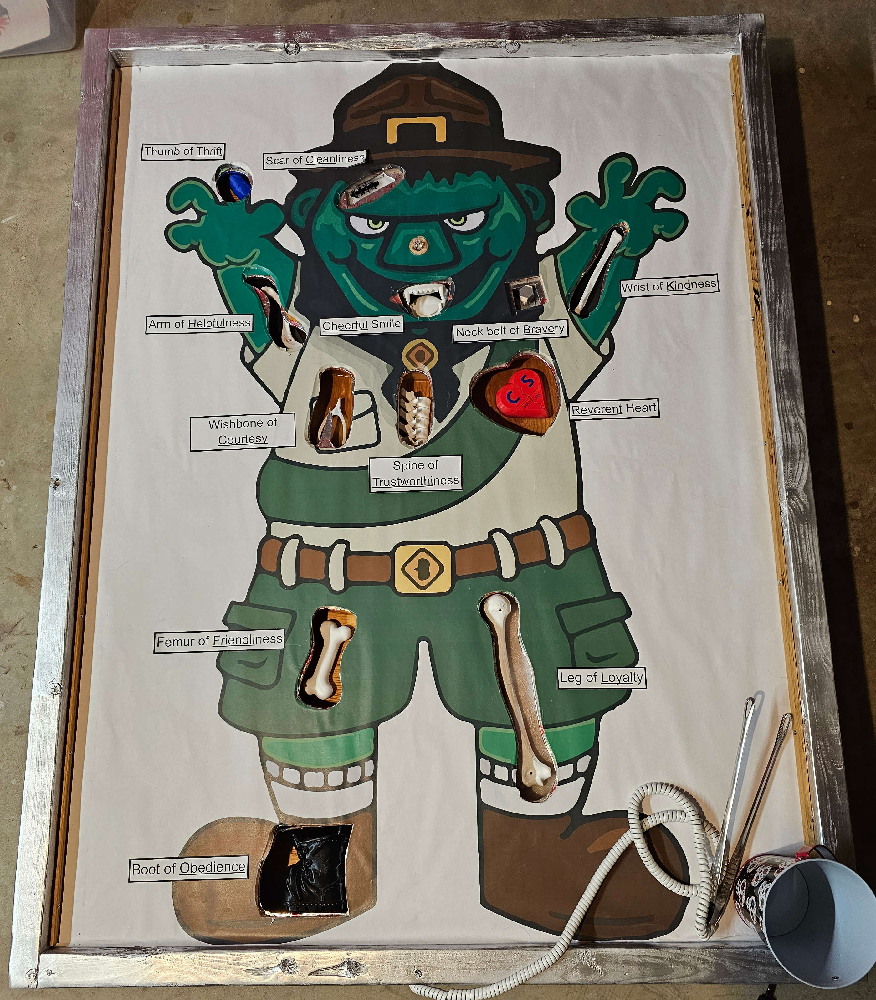

# frankenscout-operation

Project files for a Trunk or Treat game: Arduino code, Kicad files, and general
design overview. Inspired by the game Operation with enhancements for multiple
faults before a game over, lots of gameplay sounds, and LED blinking patterns.

This was specifically for a Cub Scout Trunk or Treat event, so it's themed
around the 12 words of the Cub Scout Law: Trustworthy, Loyal, Helpful, Friendly,
Courteous, Kind, Obedient, Cheerful, Thrifty, Brave, Clean and Reverent.

## Components

- Arduino Nano: https://store.arduino.cc/products/arduino-nano
- MP3 Trigger: https://www.robertsonics.com/mp3-trigger
- Aux-in-compatible boombox speaker
- Custom PCB printed by PCBWay
- 3D printed bones
- 2x4s and 1/4" playwood (3'x4' playfield)
- Metal tongs + phone cord
- Metal HVAC foil tape for lining the edge of the bone boxes
- Big printout playfield
- random LEDs, wires, resistors, JST connectors, 74HC595 IC
- So much hot-glue

## Playthrough

LEDs quickly cycle through lighting up each of the 12 bone boxes one at a time,
randomly stopping on one.

Play a recording of one of our Scouts reciting the Scout Law word corresponding
to the lit up bone.

Start playing a randomly selected Halloween themed song.

The player uses the attached metal tongs to try to remove the lit up bone.

Each time the player touches the edge of the bone box, a randomly selected
warning sound is played. These sounds are recordings of our Scouts making spooky
sounds. Change the color of the nose to correspond to the warning level (green,
orange, blinking orange).

After playing the warning sound, resume playing the theme song.

If the player gets 3 warnings, the game is over. Turn the nose red and play a
short game over song. Start a new game.

If the player successfully removes the bone, trigger a separate switch to play
the win game song and have all the LEDs light up. Start a new game.

## Table

Nothing fancy, just some 2x4s screwed together. I added some legs to give some
space between the underside of the playfield and the ground below. Kids might
lean on the table, so make it strong.

## Playfield

1/4 inch plywood, roughly 3'x4'

## Picture

One of the other parents in our Den has access to a large color plot-printer at
work. I don't have any details on what it was.

I asked google to find me a picture in the appropriate theme, but I really
wanted to use something generated by Midjourney or Stable Diffusion.

## Cut-outs

Hope you're handy with a Jigsaw! I ended up cutting out wider holes on the
playfield, and then glued pieces to the underside with a more close-fitting bone
shape. These glued-on pieces are what form the edge of the bone boxes that are
crucial to the game. The inner edge of these holes is lined with metal foil tape
to complete the circuit through the metal tongs and back to the Arduino
interrupt pin.

The next time I do this I would consider 3D printing these pieces as well.

## Bone boxes

These were just roughly cut pieces of scrape 1/4 wood laminate, hot-glued
together. These don't really need to look nice, other than what can be seen
through the cut-outs from the top side of the play field.

I also hot-glued a small piece of stripboard with a few LEDs and a JST connector
into the corner of each bone box.

## Bones

One of the other parents in our Den did the 3D printings of the bones, so I
don't have the data files or other parameters for the prints. thingiverse.com
has so much to choose from.

## Electronics

The heart of this is an Arduino Nano.

It uses the Serial pins to talk to the MP3 Trigger.

The Nano only supports interrups on pins 2 and 3, so these are what I used for
the triggers for game faults and game wins.

I went overboard and used this as an opportunity to learn a bit about PCB
design, so I learned how to use Kicad to design the PCB and then ordered pieces
through PCBWay.

## Sounds

For music, I was able to find a good amount of stuff on the freemusicarchive.org
(e.g. Toccata and Fugue D Minor). With google, you can find so much more.

I used VLC and Audacity to convert these files so that the MP3 Trigger could
play them. I'm not sure if it was a bitrate thing or what, but some of the files
skipped during playback without convertion.

I just used my Mac to record the voices of our Scouts making spooky sounds and
reciting the words of the Scout Law. I used Audacity to cut up the audio files.

In the code I have a few separate start and stop indexes for the theme songs,
warn sounds, win songs, and lose songs. I use `random` to pick a random file in
the range between these indexes.

The MP3 Trigger use a micro SD card to for loading the MP3 files. These files
have a numeric prefix XXX that is used to index each file; i.e. a file named
`012-some-file.mp3` will be played when `t12` is sent over the Serial port to
the MP3 Trigger.

## Useful Links

- https://www.instructables.com/Multiplexing-with-Arduino-and-the-74HC595/
- https://docs.arduino.cc/tutorials/nano-every/uart
- https://learn.sparkfun.com/tutorials/mp3-trigger-hookup-guide-v24
- https://www.baldengineer.com/state-machine-with-enum-tutorial.html

## Improvements

- Use a magnetic switch (Normally Open) and magnets in the bones to trigger the
win events
- Normalize the sound files better to make the sound of our Scouts louder
- I'd like to add some kind of buzzer or solenoid popper to the game to give it
a bit more physical feedback

## Bugs

- The Arduino Nano that I'm using will temporarily ignore interrupt events every
so often, making the game seem unresponsive. After a bit of time, the interrupts
start working again, without a power cycle. I'm not sure what the source of this
is. I'm using Nano pins 2 and 3 in INPUT_PULLUP mode. If you have any ideas
please let me know!
- I'm not a C++ programmer, and coding in an event loop is tricky. There were
many bugs, and there are probably still a few.
- I ran out of time and wan't able to get the nose LEDs working properly. TODO
